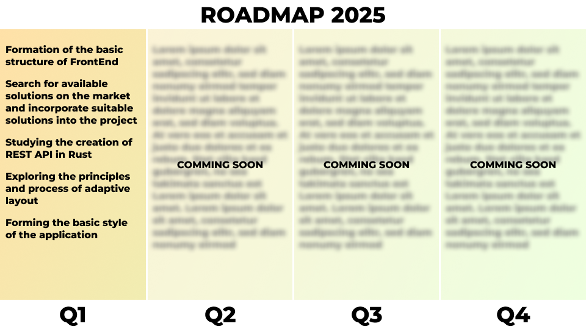

# Hi there👋
We are Cute World - we are a team of web developers. Our goal here is to create a new idea of how an adequate social network should look like, without any unnecessary elements.
# Cute World
Cute World - is a lightweight social networking project that aims to create a place where Influencers can create and share content, and followers can support them with their reactions and donations.
## Software Stack
In our work, we define the structure of the future application. We use the following mapping as a basis for development.

FrontEnd
| OS    | FrontEnd                      | WebServer                   |
| :---: | :---------------------------: | :-------------------------: |
| Linux | [ReactJS](https://react.dev/) | [Nginx](https://nginx.org/) |

BackEnd
| OS    | BackEnd                                  | DataBase                                  | FileServer                  |
| :---: | :--------------------------------------: | :---------------------------------------: | :-------------------------: |
| Linux | [Cargo Rust](https://www.rust-lang.org/) | [PostgreSQL](https://www.postgresql.org/) | [Minio S3](https://min.io/) |

Mail Server
| OS    | Mail Server                |
| :---: | :------------------------: |
| Linux | [Mailu](https://mailu.io/) |

The data can be further updated at the stage of solution testing and supplemented as new application development vectors emerge.

## Project RoadMap
During the application development process, we will think through the processes we consider important to overcome to achieve the result. We will put these processes into our roadmap.

